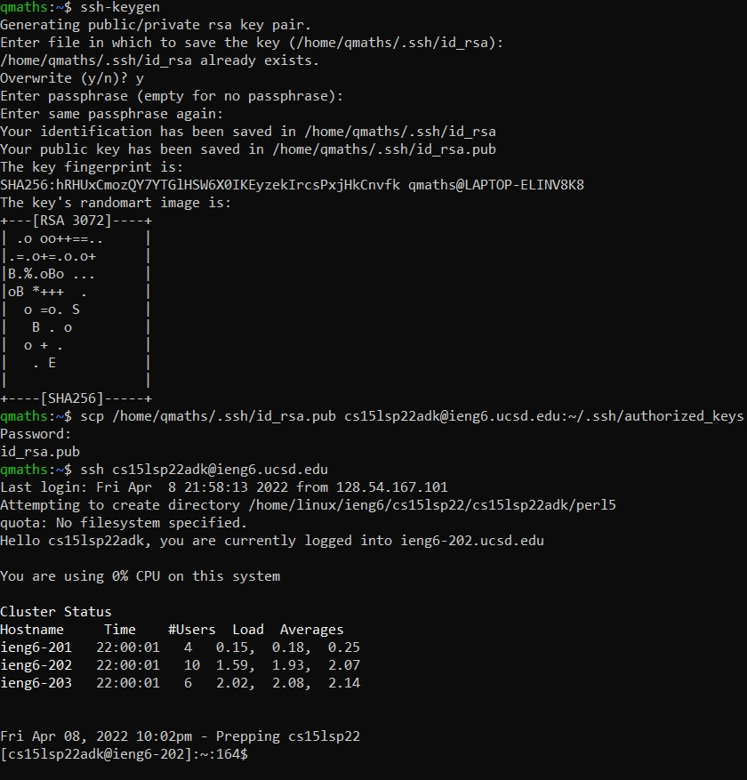

# Week 2 Lab Report
*Quincy Sewell, CSE 15L, Section A00.*

The following is a tutorial for how to log into a course-specific account on ieng6.

### Step 1
In order to log into a course-specific account on ieng6, it is helpful to install Visual Studio code, a code editor. Visual Studio code can be installed at the following link: [https://code.visualstudio.com/](https://code.visualstudio.com/). Once installed, after opening Visual Studio code, it should look something like following:


Also, if you are on Windows, install OpenSSH at the following link:

[InstallOpenSSH](https://docs.microsoft.com/en-us/windows-server/administration/openssh/openssh_install_firstuse)

### Step 2
Next, bring up a terminal. At the command line, type exactly the following:
```
ssh <yourUsername>@ieng6.ucsd.edu
```
Here, `ssh` stands for "Secure Shell Protocol", which is used to remotely access other computers, and `<yourUsername>` is meant to be replaced with whatever your username is, which can be found at the following link: [https://sdacs.ucsd.edu/~icc/index.php](https://sdacs.ucsd.edu/~icc/index.php). Finally, `ieng6@ucsd.edu` is called the domain name of the computer you will be accessing.

After typing the above command, the terminal should prompt you for a password. Enter your password (be forewarned: it will not show up on the screen as you are typing it) and hit Enter or Return. You should then see something like the following:


### Step 3
Now that you have remotely accessed another computer, it is helpful to know a few more terminal commands. One of these is `pwd` (and stands for "print working directory"), and shows you what folder or directory you are currently in. Another is `ls` (and stands for "list"), and has the function of listing all of the subdirectories under the one you are currently in. There is also `cd` (which stands for "change directory"), which serves to change the directory that you are in. It has the following (simplified) syntax:
```
cd \<filePath\>
```
Here, `\<filePath\>` can be specified by either an *absolute path* or a *relative path*. An absolute path is a path from the root directory (that is, the directory that contains all other directories and files). A relative path is a path starting from the current working directory. `cd ..` changes the working directory to the one immediately above the current working directory. Here is an image of some examples of these commands and their output (not all of which are described here):


### Step 4
Next, it is helpful how to learn to move files from one computer to another with scp ("secure copy"). First, return to the local machine by typing
>exit

and then Enter. Now, type
>cd ~

and Enter to return to the home directory, and then type
>cat \> textFile.txt

and Enter. Here, you are creating a text file to be copied to another computer called textFile.txt, and the terminal should prompt you to enter text. You can write some text, and then when you are ready to save the file, you can hit CTRL+D. Use ls to make sure the file is there now, and then you can type
>cat textFile.txt

and Enter to have the contents of the file displayed as output. Next, to copy the file to a remote computer, type the following:
>scp textFile.txt \<yourUsername\>@ieng6.ucsd.edu:~

and Enter. This should copy the file textFile.txt to a remote computer. To check that this is the case, use ssh to access the computer, and then use ls to check that textFile.txt is there. Use cat again to read the contents to make sure that they have remained the same, too. After you're done, your terminal should look something like the following:


### Step 5
On your computer, type the following:
>ssh-keygen

and Enter. Press Enter as many times as necessary as the command line prompts you for various purposes. After this, you will get a bunch of output, which documents the fact that you have created two new files on your (local) system: a *private key* and a *public key*, which the ssh command will use in the future to allow you to remotely connect to the computer you copy the public key to without having to type a password. Use ssh as normal to login to the server, and then
>mkdir .ssh

and Enter to make a directory called .ssh in your home directory on the remote computer. Then use exit to return to your local computer, and use scp to copy the file id_rsa.pub (the public key, located in /Users/\<yourUsername\>/.ssh) to the remote computer's directory ~/.ssh/authorized_keys. After you do this, you should be able to use ssh again without using your password! Your terminal should look something like the following after completing this step:



### Step 6
Finally, to further optimize remote running, there are several things that one can do. For example, one can define an alias in .bashrc if you happen to be working with bash. You can also run multiple commands by using semicolons to separate each command, as well as quotes after an ssh command to run a command on the remote computer (contained within those quotes).

For example of how one can optimize remote running, see the following image:


Here, "c" is an alias I defined in .bashrc. Also, one can compile and run a java file in two keystrokes on a remote machine (up arrow to retrieve previous command, followed by Enter).

This completes the tutorial, and my first lab.


---
The following is an image that was added to this file for the purposes of completing Lab 2:

