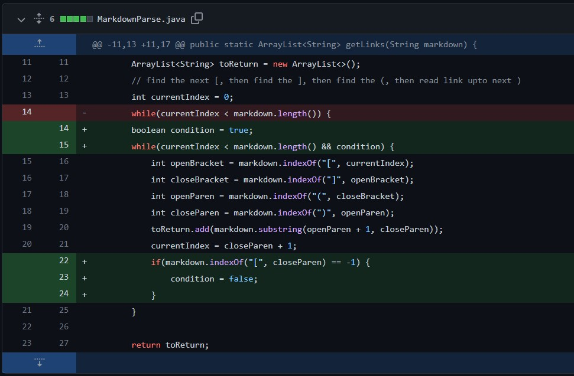
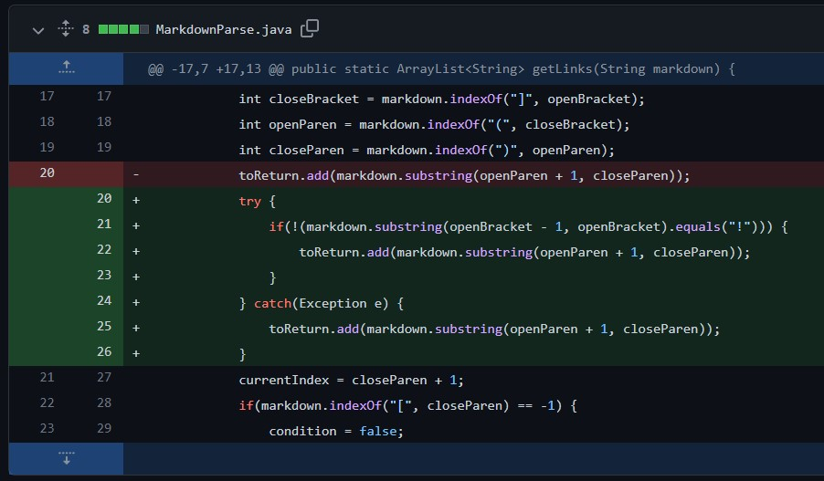
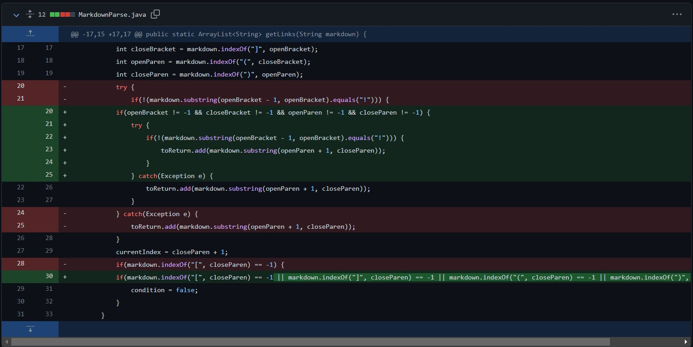

# Week 4 Lab Report
*Quincy Sewell, CSE 15L, Section A00.*

The following represents three changes made in a file called MarkdownParse.java, in an effort to address bugs in its code.

## Code Change 1


Link to the test file for failure-inducing input that prompted the above change (note that the 5th empty line is not visible here, but is a part of the file):

[test-file-2.md](https://github.com/qsewell/markdown-parser/blob/main/test-file-2.md?plain=1)

The symptom initially caused by the above input was the following:
```
$ java MarkdownParse test-file-2.md  
Exception in thread "main" java.lang.OutOfMemoryError: Java heap space  
        at java.base/java.util.Arrays.copyOf(Arrays.java:3512)  
        at java.base/java.util.Arrays.copyOf(Arrays.java:3481)  
        at java.base/java.util.ArrayList.grow(ArrayList.java:237)  
        at java.base/java.util.ArrayList.grow(ArrayList.java:244)  
        at java.base/java.util.ArrayList.add(ArrayList.java:454)  
        at java.base/java.util.ArrayList.add(ArrayList.java:467)  
        at MarkdownParse.getLinks(MarkdownParse.java:19)  
        at MarkdownParse.main(MarkdownParse.java:30)
```
This symptom can also be seen at the following link to the relevant commit for MarkdownParse.java:

[Commit1](https://github.com/qsewell/markdown-parser/commit/7f60c5a2c2935d5deef70ea59ecda40d8a803cda)

The bug had to do with the fact that the condition of the while loop was never **not** satisfied (because the length of the input for the method getLinks was always greater than the currentIndex local variable). This bug resulted in the symptom expressed above. The symptom was expressed when given the failure-inducing input of test-file-2.md. This bug was corrected by adding an additional condition to the while loop which would be false in situations where "\[" was not found in the input file after the currentIndex local variable. This made it so that the program ran successfully when given test-file-2.md as an input.

## Code Change 2


Link to the test file for failure-inducing input that prompted the above change:

[test-file-3.md](https://github.com/qsewell/markdown-parser/blob/main/test-file-3.md)

The symptom initially caused by the above input was the following:
```
$ java MarkdownParse test-file-3.md
[https://something.com, https://something.com, imagelinkhello, some-thing.html, imagelinkhello2]
```
This symptom can also be seen at the following link to the relevant commit for MarkdownParse.java:

[Commit2](https://github.com/qsewell/markdown-parser/commit/175ec3592e757d619515929d39a6e1ae1b490f9c)

The bug here had to do with the fact that MarkdownParse.java included code that would copy the image links as well as other links, because it simply added the Strings between "\[" and "\]" characters. To correct this, a try-catch block was used with an if statement in the try branch having a condition that checked for whether the character immediately before "\[" was "!" or not. The try-catch structure was necessary because it is possible that an IndexOutOfBoundsException occurs when checking that condition. This bug resulted in the symptom expressed above, which incorrectly includes image file links. This symptom was induced by the failure-inducing input test-file-3.md.

## Code Change 3


Link to the test file for failure-inducing input that prompted the above change:

[test-file3.md](https://github.com/qsewell/markdown-parser/blob/main/test-file4.md)

The symptom initially caused by the above input was the following:
```
$ java MarkdownParse test-file3.md  
Exception in thread "main" java.lang.StringIndexOutOfBoundsException: begin 0, end -1, length 31  
        at java.base/java.lang.String.checkBoundsBeginEnd(String.java:4601)  
        at java.base/java.lang.String.substring(String.java:2704)  
        at MarkdownParse.getLinks(MarkdownParse.java:25)  
        at MarkdownParse.main(MarkdownParse.java:40)  

This symptom can also be seen at the following link to the relevant commit for MarkdownParse.java:
```
[Commit3](https://github.com/qsewell/markdown-parser/commit/e811f1efe9fd6fd2762a28cef5e37fc3c0be24f2)

The bug here had to do with the fact that the first call to substring method in getLinks attempted to access a negative index. The symptom that this resulted in was an IndexOutOfBoundsException. To correct for this, I enclosed all calls to substring in if statements whose then branches only run when all local variables are not equal to negative one. The symptom expressed above (the IndexOutOfBoundsException) was induced by the failure-inducing input test-file3.md.
