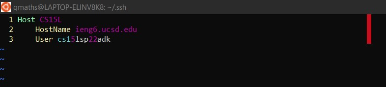
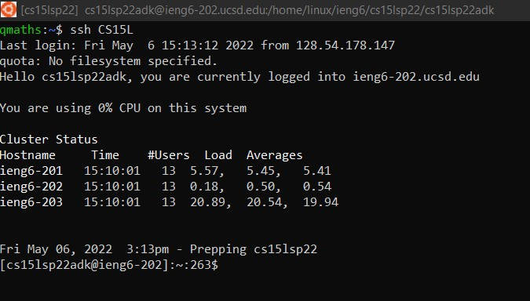
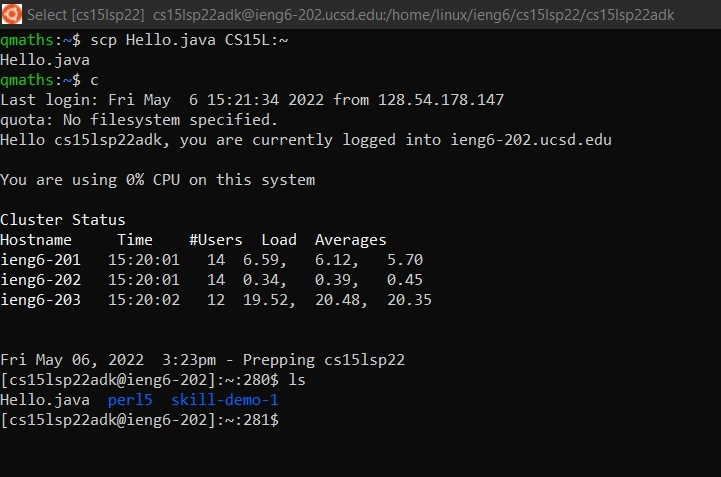
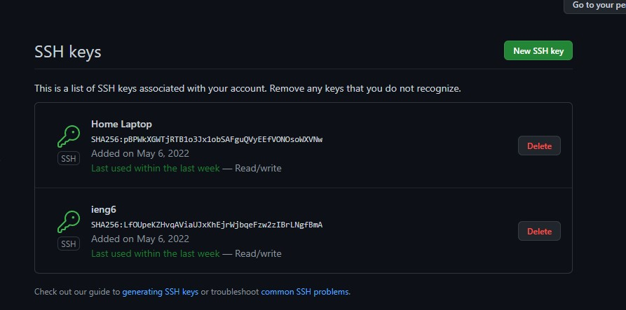
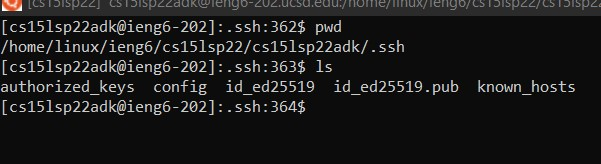
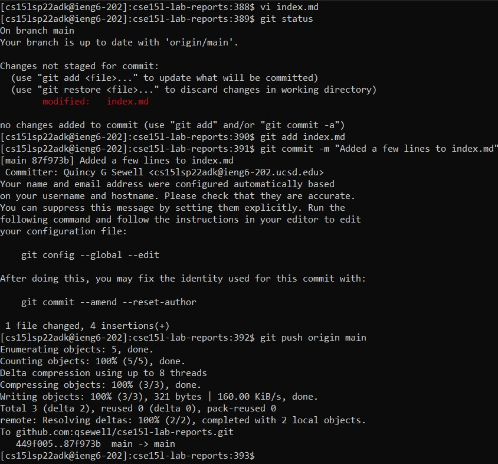
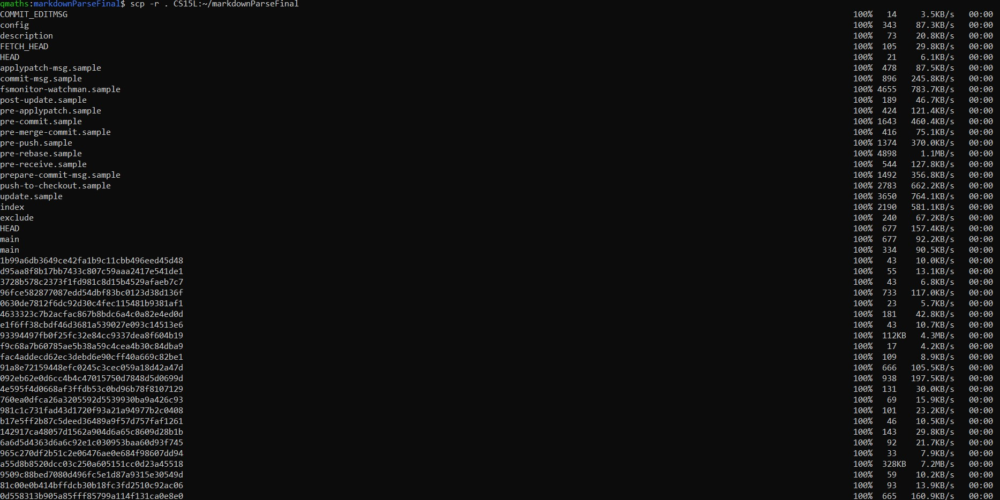
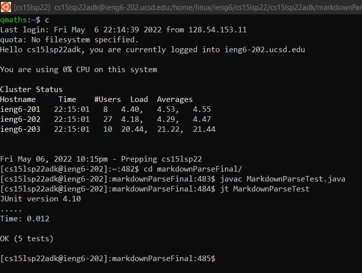
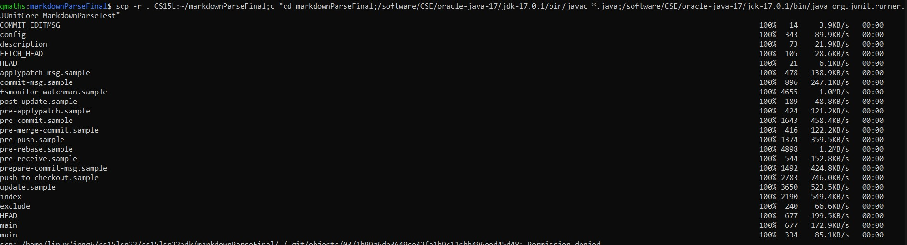
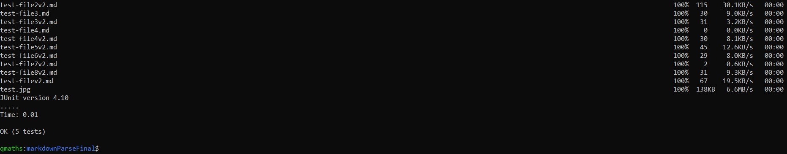

# Week 6 Lab Report
*Quincy Sewell, CSE 15L, Section A00*

## Streamlining ssh Configuration
The following is an image of my .ssh/config file contents, as displayed in the VIM editor.

The next image displays me logging into my CSE 15L course-specific account on ieng6 using the alias I chose (CS15L).

The next image captures me using the alias that I defined (CS15L) to facilitate my use of scp. One can see from this image that I copied a file called "Hello.java" in the home directory of my computer to the home directory for my user on ieng6.

## Set Up Github Access from ieng6
In the image below, one can see that I have added two public keys to my Github account. One is for the laptop that I regularly use, and the other is for my ieng6 account.

One can see where the private key is stored on my ieng6 account in the below image. In particular, the file containing the private key is called id_ed25519. Additionally, the file entitled id_ed25519.pub contains the public key.

In what follows, one can observe that I made edits to index.md (located in the repository in which this file is contained), and then proceeded to use `git add` and subsequently `git commit`. Finally, I used `git push origin main` to push the changes that I made to index.md to the origin.

The commit that I made in the above image can also be viewed at the following link:
[Commit Made in Above Image](https://github.com/qsewell/cse15l-lab-reports/commit/87f973bc8719cdeb3da56d3a6e526bbabb8e74b1)

## Copy Whole Directories with `scp -r`

In the image below, one can see that I used `scp -r` to copy the entirety of a directory called markdownParseFinal from my local computer to my account on ieng6. Not all of the output is shown, because there were many files that were copied in this process, and the entire output is rather long.

Next, I used an alias defined in .bashrc (`c`) which stood in for an ssh command that allows me to access my course-specific account on ieng6 (as can be seen in the top portion of the image below). I then compiled the appropriate java files and then used another alias (again defined in .bashrc on the remote machine, this time called `jt`) in order to run the JUnit tests, all of which passed (as can be seen from the lower part of the image below).

I then used `scp` with the recursive option `-r` along with semicolons and my `ssh` alias `c` again together with commands to be run on the remote machine which compiled and ran the JUnit tester file. Some of the files that `scp` copied over are in the image below.

And the bottom of the output from the last displayed command is shown in the image below. As can be seen, all JUnit were ran and passed.

