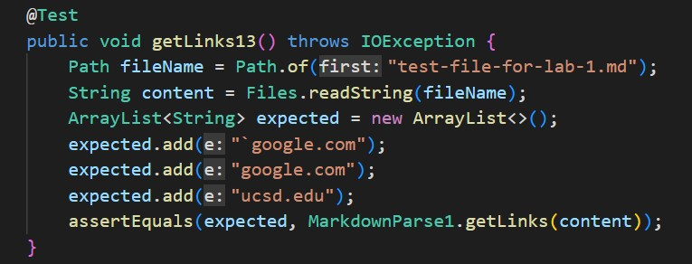
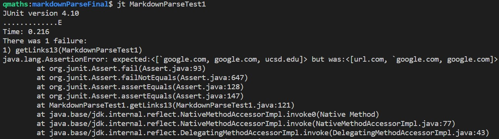
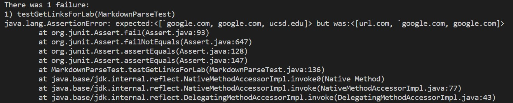
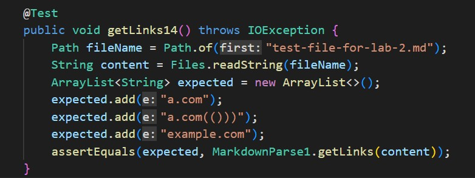
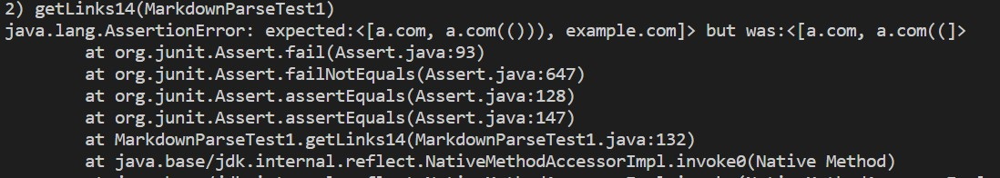
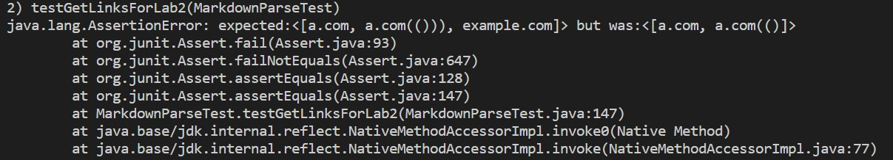
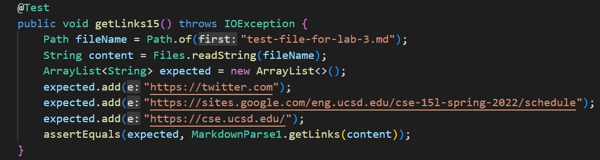
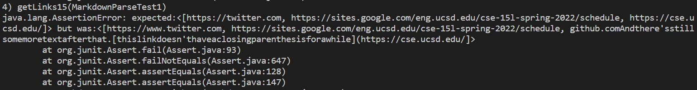
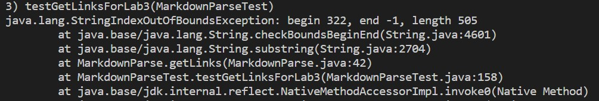

# Week 8 Lab Report
*Quincy Sewell, CSE 15L, Section A00*

## Markdown Parse Repository Links
The following is a link to my MarkdownParse repository:
[My MarkdownParse Repository](https://github.com/qsewell/markdownParseFinal)

It should be noted that the MarkdownParse file that I am using from that repository is called "MarkdownParse1.java", and *not* "MarkdownParse.java".

The following is a link to the MarkdownParse repository that I reviewed in Week 7's lab:
[Markdown Parse Repository That I Reviewed](https://github.com/aaronchan32/markdown-parser)

## Test 1
The following .md file represents the first test for both my own MarkdownParse implementation and the MarkdownParse implementation that I reviewed for Lab 7:

```
`[a link`](url.com)

[another link](`google.com)`

[`cod[e`](google.com)

[`code]`](ucsd.edu)
```

Based on the preview shown in VS Code, the expected output for such an input is:
```
[`google.com, google.com, ucsd.edu]
```

Here is my implementation of a JUnit test for this input:


However, when run, my implementation of MarkdownParse gives the incorrect output, as can be seen from this terminal output of running the test (a portion of the output is omitted for the sake of brevity):


When such a test is run on the implementation that I reviewed in Week 7, we also get an incorrect output (again, a portion of the output is omitted here for the sake of brevity):



## Test 2
The following .md file represents the second test for both my own MarkdownParse implementation and the MarkdownParse implementation that I reviewed for Lab 7:

```
[a [nested link](a.com)](b.com)

[a nested parenthesized url](a.com(()))

[some escaped \[ brackets \]](example.com)

```

Based on the preview shown in VS Code, the expected output for such an input is:
```
[a.com, a.com(()), example.com]
```

Here is my implementation of a JUnit test for this input:


However, when run, my implementation of MarkdownParse gives the incorrect output, as can be seen from this terminal output of running the test (a portion of the output is omitted for the sake of brevity):


When such a test is run on the implementation that I reviewed in Week 7, we also get an incorrect output (again, a portion of the output is omitted here for the sake of brevity):



## Test 3
The following .md file represents the third test for both my own MarkdownParse implementation and the MarkdownParse implementation that I reviewed for Lab 7:

```
[this title text is really long and takes up more than 
one line

and has some line breaks](
    https://www.twitter.com
)

[this title text is really long and takes up more than 
one line](
https://sites.google.com/eng.ucsd.edu/cse-15l-spring-2022/schedule
)


[this link doesn't have a closing parenthesis](github.com

And there's still some more text after that.

[this link doesn't have a closing parenthesis for a while](https://cse.ucsd.edu/


)

And then there's more text
```

Based on the preview shown in VS Code, the expected output for such an input is:
```
[https://twitter.com, https://sites.google.com/eng.ucsd.edu/cse-15l-spring-2022/schedule, https://cse.ucsd.edu/]
```

Here is my implementation of a JUnit test for this input:


However, when run, my implementation of MarkdownParse gives the incorrect output, as can be seen from this terminal output of running the test (a portion of the output is omitted for the sake of brevity):


When such a test is run on the implementation that I reviewed in Week 7, we also get an incorrect output (again, a portion of the output is omitted here for the sake of brevity):


## Final Considerations
I do not think that there does exist a small code change (less than 10 lines) to my implementation of MarkdownParse that could make my program work for the first input above and related cases having to do with inline code and backticks, although there certainly could be one that I am overlooking. The reason why I think this would be a more involved change is because there are so many cases of backticks to consider (e.g., backticks within the square brackets, backticks where one is to the left of the opening square bracket and one is enclosed by the square brackets, backticks that enclose the square brackets, backticks where one is to the right of the closing square bracket and one is encolosed by the square brakcets, etc.). An implementation of a stack structure as a way of keeping track of pairs of backticks could be useful in correcting for these kinds of inputs.

I also do not think that there exists a small code change (less than 10 lines) for my implementation of MarkdownParse that could make my program work for the second input above and related cases having to do with nested square brackets and parentheses, although there certainly could be a small change that I am overlooking. My rationale for why this would be a more involved change rather than a small change is that dealing with nested structures often requires the implementation of a stack data structure, at least from what I have learned recently, and I do not think that less than 10 lines would be sufficient for including such a structure.

Finally, for the third kind of input above, I do think a small change to my own implementation of MarkdownParse could correct the error. In particular, I think that including an if statement in the getLinks() method which checks for whether a closing parenthesis exists on the _same line_ as the opening parenthesis could be valuable. Specifically, if both parentheses exist on the same line, we can include in the "then" branch a line which adds the appropriate link to the output, but otherwise (i.e., in the "else" branch), we can choose to not include the text following the opening parenthesis on that line _if_ there is text between the following line and the next closing parenthesis and update the index at which we are situated in the .md file; if there is not, then we can add the link to the output as usual.
