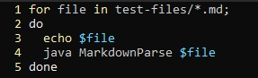
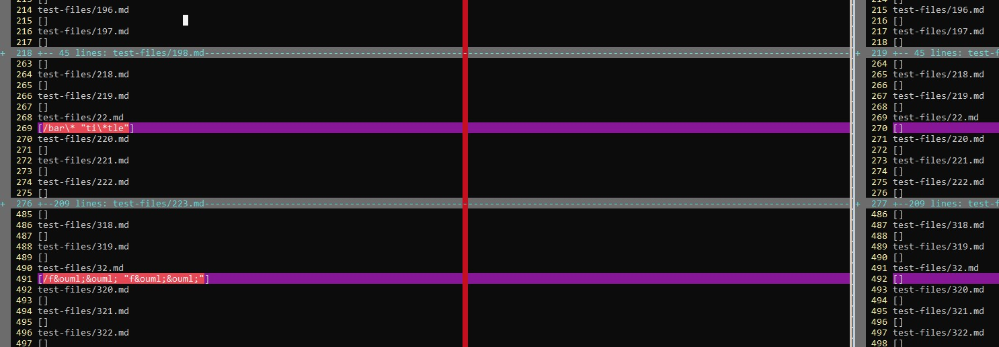
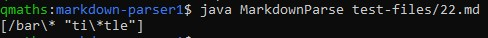
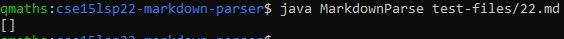
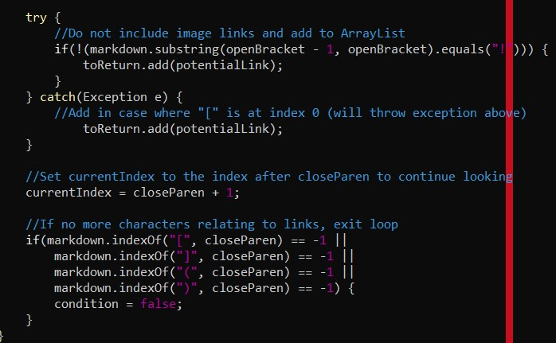
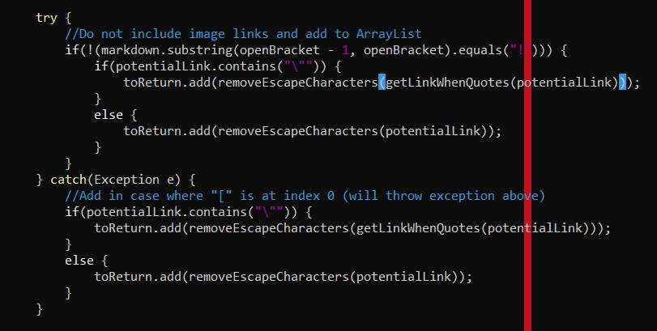
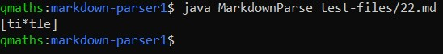
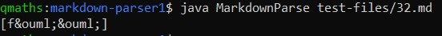
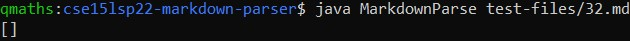
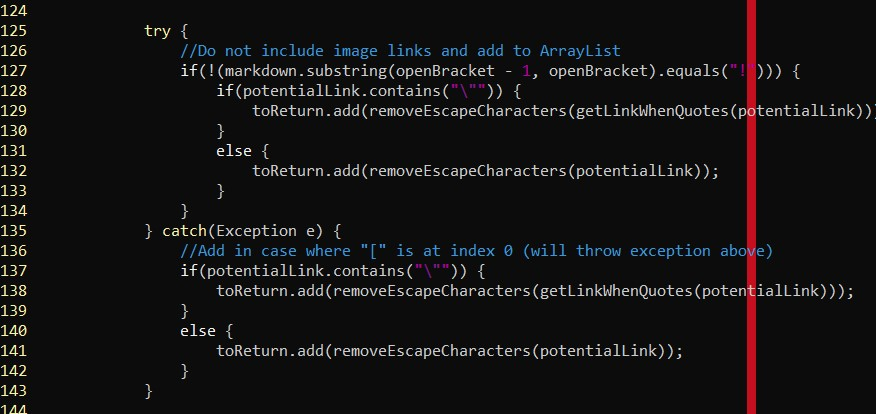

# Week 10 Lab Report
*Quincy Sewell, CSE 15L, Section A00*

This is my fifth and final lab report for CSE 15L, Section A00 during Spring Quarter 2022 at UCSD. It focuses on two particular .md test files which induced different 
outputs for my implementation of MarkdownParse and the implementation of MarkdownParse provided to me in Week 9 of this course.

## How I Located Tests with Different Results
In order to find these two .md test files amid the 652 total .md test files in the test-files/ directory, I began by running the following bash script in each of the repositories containing the implementations of MarkdownParse using `bash script.sh > results.txt` (where script.sh was the name of the file containing the following bash script):

In other words, for each file in the test-files/ directory, I printed out the name of the file followed by its corresponding output when MarkdownParse was run on it, and I did this for each of the two implementations of MarkdownParse. I also appended all of this output to to a text file named results.txt in each repository (this corresponds to the `> results.txt` part of the command mentioned earlier, and I later renamed the text file in _my_ repository results2.txt so that I could further distinguish between the two).

Next, in my own repository, I used `vimdiff results2.txt ../cse15lsp22-markdown-parser/results.txt` to compare the two text files alongside each other in vim. The following image presents a portion of the resulting display (left is my implementation's results, right is the results of the implementation I was given in Week 9):

From this, it is clear that many tests have the same output for both implementations of MarkdownParse, which is reassuring, but the tests 22.md and 32.md are two tests that have different output depending on which implementation of MarkdownParse one uses - they are highlighted horizontally with purple bars. This is how I located these two tests.

## Links to Test Files With Different Results
The following is a link to the test file 22.md, out of which different results were produced depending on the MarkdownParse implementation:
[22.md](https://github.com/nidhidhamnani/markdown-parser/blob/main/test-files/22.md?plain=1)

And this is a link to the test file 32.md (it likewise had different results):
[32.md](https://github.com/nidhidhamnani/markdown-parser/blob/main/test-files/32.md?plain=1)

## Examination of Different Outputs for 22.md
For the test file 22.md, neither implementation of MarkdownParse gave the correct output; as can be verified by using the preview of a Markdown file's rendering in Virtual Studio Code, the correct (expected) output should be:

[ti\*tle]

My implementation of MarkdownParse gave the following output (this can also be seen from the result of the `vimdiff` command discussed and displayed earlier):

The implementation of MarkdownParse I was given in Week 9 gave the following output (this can also be seen above):

Clearly these outputs are different and both are incorrect. The incorrect behavior in my implementation is in the lines contained in the image below:

In the above code, `potentialLink` represents the String that is found between two open parentheses. As can be seen in the code above, I simply add `potentialLink` to
the ArrayList that will eventually be returned. This explains the incorrect output; my MarkdownParse simply returned all of the text in between the parentheses. However, it should instead only return the text contained in between the quotes, and it should also ignore the escape character "\\". To remedy this issue, I in fact
added a method in MarkdownParse called `getLinkWhenQuotes` that returns the text between two double quotes, and another method that removes all escape characters (in markdown) from a String, called `removeEscapeCharacters`. The following image shows me calling both of these methods, and effectively correcting this bug:

And finally, we can see that my program now does give the correct output for 22.md:

## Examination of Different Outputs for 32.md
For the test file 32.md, neither implementation of MarkdownParse gave the correct output. This discussion will have to do with HTML entities, and my discussion here might be displayed incorrectly on GitHub Pages, but it will be displayed correctly in my GitHub repository. As can be verified by using the preview of a Markdown file's rendering in Virtual Studio Code, the correct (expected) output should be:

[f&ouml;&ouml;]

My implementation of MarkdownParse gave the following output originally (this can also be seen from the result of the `vimdiff` command discussed and displayed earlier):

[/f\&ouml;\&ouml; "f\&ouml;\&ouml;"]

However, after correcting for the 22.md test, it now gives the following (still incorrect) output:

The implementation of MarkdownParse I was given in Week 9 gave the following output (this can also be seen above):

Clearly both outputs are different and both are incorrect. The bug in my code has to do with the fact that I do not account for HTML entities in link addresses; in this case, "\&ouml;" is printed as a String literal in my MarkdownParse's output for this MarkdownParse file, but "&ouml;" should be printed instead. However, I do not think that much can be done, especially because I cannot get the terminal to display special characters like &ouml;. So this may be the best output I can reasonably achieve. One thing that I could do is signify in some way that "\&ouml;" stands in for a special character - perhaps I could print something like "There are special character(s) in the following link address that cannot be displayed:" by concatenating that with `potentialLink` before adding it to `toReturn` in the code below (these would be changes in **lines 129, 132, 138, and 141** - I would have to add conditions of some kind which check if there are HTML entities in `potentialLink` before adding that message, of course):

